**English** | **[繁體中文](README_ZH.md)** | **[简体中文](README_CN.md)**

# NTE DPS Meter

A non-invasive, real-time DPS meter for **Neverness to Everness (NTE)**.

Calculates combat data in real time via passive network packet sniffing — **no memory modification, no packet tampering, no automation of any kind**.

---

## Support the Project

If this tool has been useful to you, please consider supporting continued development:

### ☕ Ko-fi — recommended

[](https://ko-fi.com/rj0217)

Direct link: [ko-fi.com/rj0217](https://ko-fi.com/rj0217)

If you donate over $6 USD, please let us know — we'd like to offer you a Sponsor serial key (Pro features) as a thank-you.

### 🪙 Crypto — USDT / USDC (BEP20 / BSC network)

```
0x55c439b27807415e80452f59ba00fee3441a802d
```

If you donate over $6 USD, please let us know — we'd like to offer you a Sponsor serial key (Pro features) as a thank-you.

### 💬 Contact

- **Discord**: https://discord.gg/nbTMDCpvrB
- **Email**: dont.stop.ha@gmail.com

---

## Features

### Real-Time DPS Overlay

Always-on-top transparent card with circular character portrait, breathing glow ring, and five rows of live data (Damage, Hits, DPS, HPS, ECT). Auto-expands during combat, auto-collapses after 5 seconds idle. Click-through during combat — zero interference with gameplay.

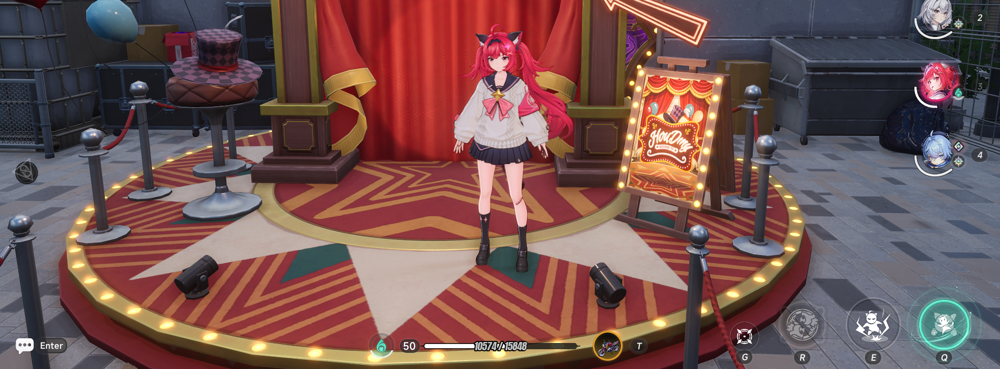
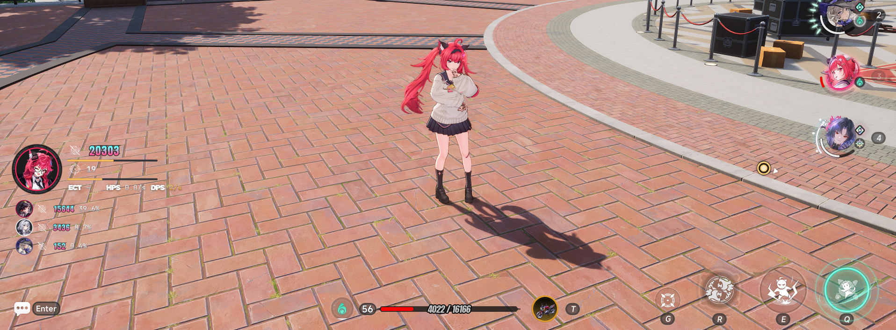

### Character Detection

Automatically identifies the active character in real time. Supports all released characters with per-character independent damage tracking across your 4-character party.

### Battle Reports & Report Manager

Press **F6** to reset stats — your current battle is automatically saved as a report. Open the Report Manager from the right-click menu to filter by damage range, sort, upload to the community platform, or delete old reports.

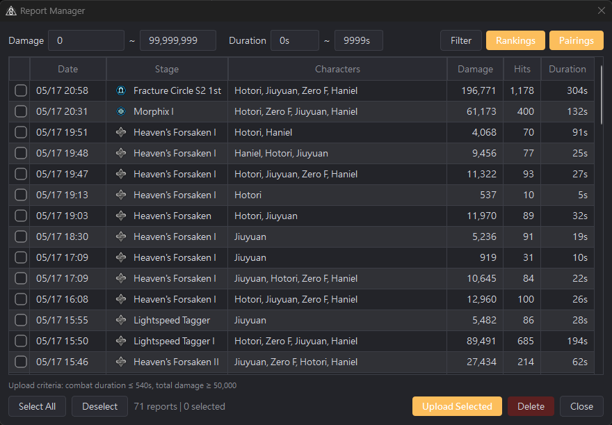

### Main Window & Damage ECG

Full team damage contribution at a glance — character ranking panel + hit detail panel + damage ECG in a three-section layout. All data stored locally.

The **Damage ECG** renders every hit as a real-time waveform. Wave colors reflect attack rhythm (green = rapid combos, gray = normal, red = burst gap). Character switch points are marked with avatar icons on the X-axis. Supports drag scrolling with inertia and Ctrl+scroll zoom.

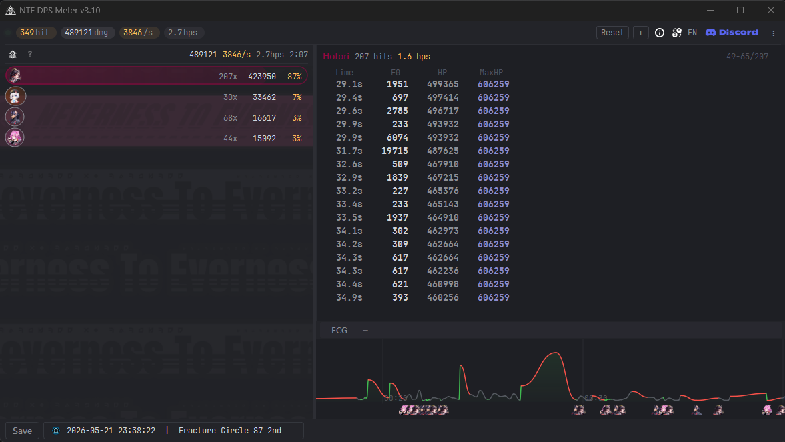

### Report Comparison (Sponsor)

Side-by-side A/B comparison of different team compositions with damage and DPS difference summary + integrated ECG.

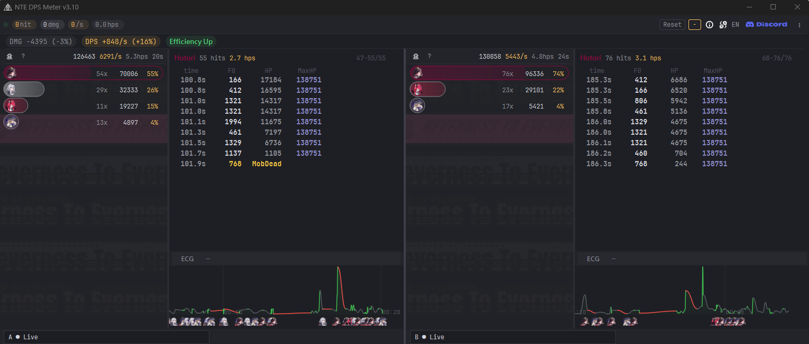

### Personal Dashboard (Sponsor)

Analyze your battle history and track personal growth across four tabs. All data processed locally — nothing uploaded.

| | |
|---|---|
| 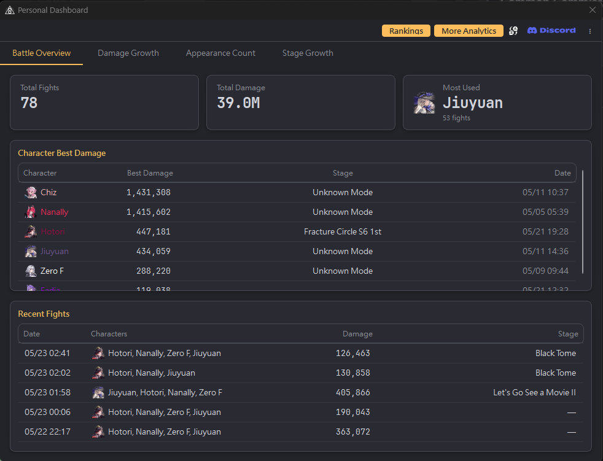 | 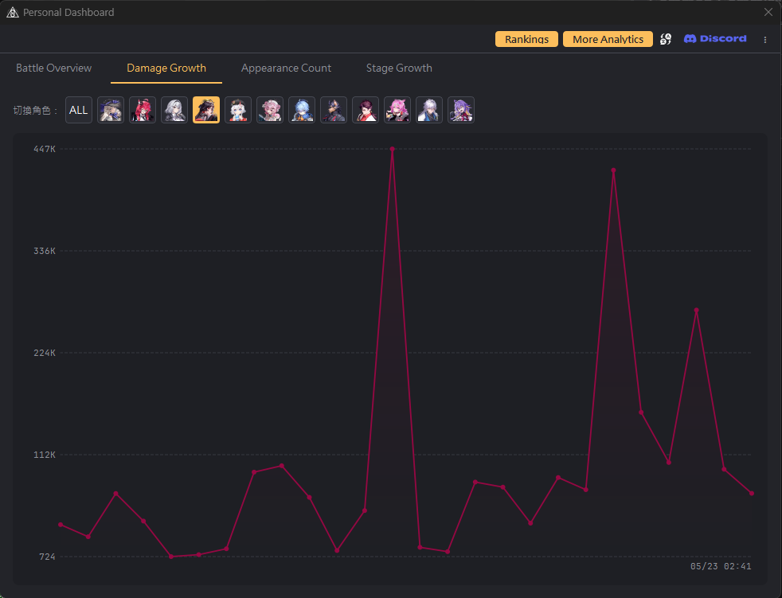 |
| **Battle Overview** — total sessions, accumulated damage, most-used character, historical max, recent battles | **Damage Growth** — per-character damage trend curves, click avatars to toggle |
| 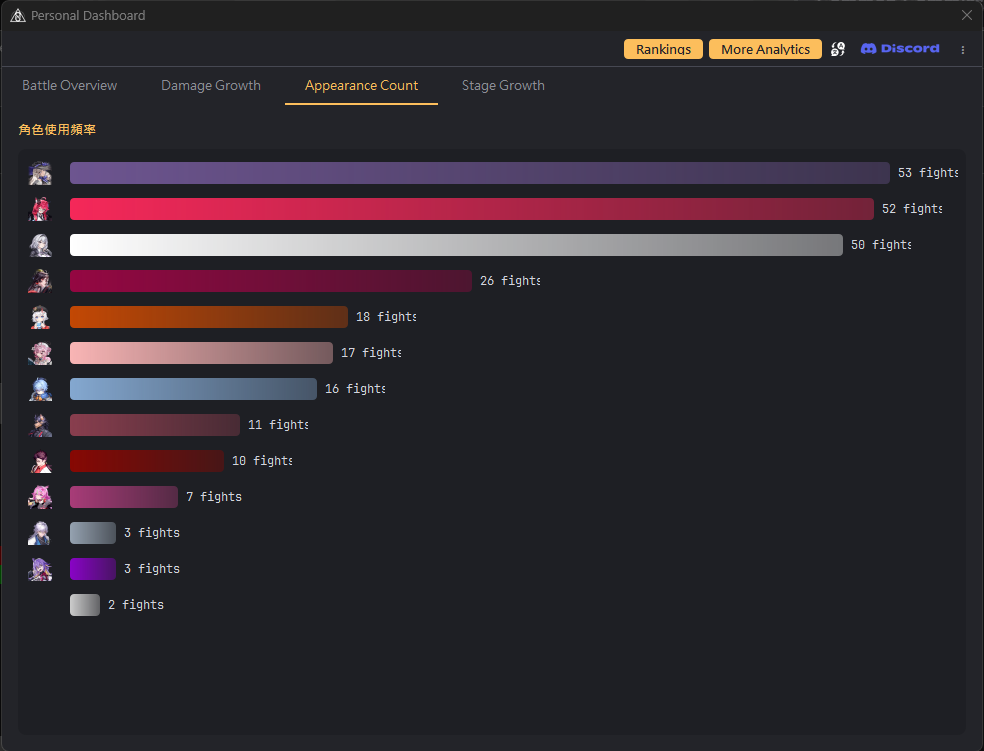 | 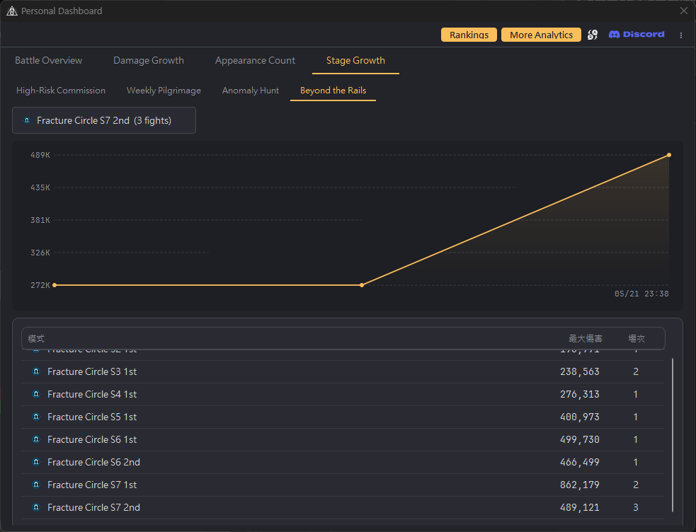 |
| **Appearance Stats** — character usage frequency | **Stage Growth** — per-stage damage progress curves |

### Cultivation Guide (Free)

Material overview for 20 characters — breakthrough materials, skill upgrades (including passives), and bond gift strategies with three optimization modes.

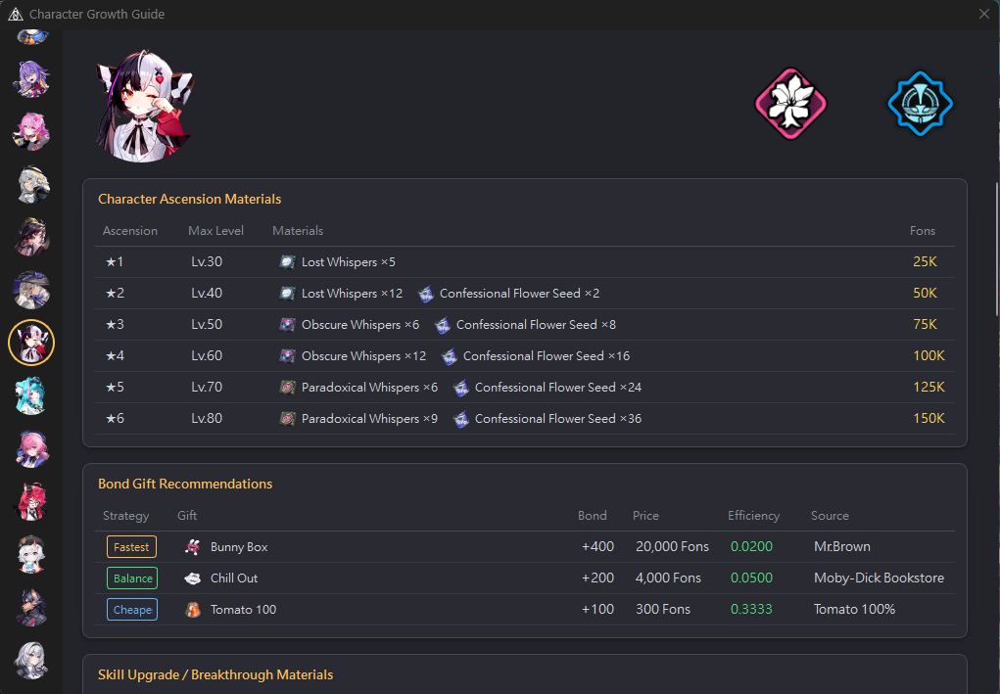
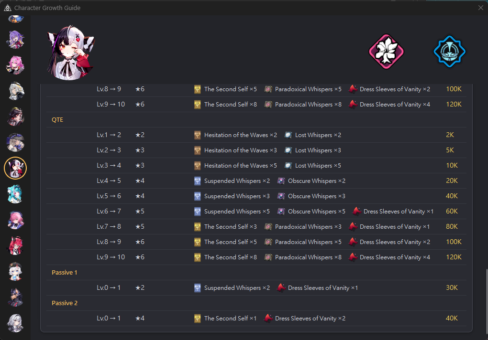

### Community Analytics — [ntedpsmeter.com](https://ntedpsmeter.com)

Live community data aggregated from uploaded battle reports:

- **Character Rankings** — damage rankings by tier (1min / 3min / 6min / 9min), showing median + max + range
- **Character Pairing Matrix** — visual heatmap of character combination adoption rates (Sponsor)
- **Discord Login** — log in with Discord; sponsors can verify serial keys directly on the web
- **Tri-lingual** — EN / 繁體中文 / 简体中文
- **Privacy-friendly** — explicit consent required before upload, data is anonymized

### Additional Features

- **Discord Account Linking** — link your Discord from the desktop app for analytics platform login and serial verification
- **Hotkeys** — F6 reset, Alt+D overlay, Alt+E main window; fully customizable
- **Network adapter selection** — manual switch for accelerator/VPN setups; ExitLag continuously supported
- **Tri-lingual interface** — 繁體中文 / 简体中文 / English, instant switch
- **System tray resident** — runs quietly, no taskbar clutter
- **Auto-updater** — check for updates from the right-click menu

---

## Free vs Sponsor

| Feature | Free | Sponsor |
|---------|------|---------|
| DPS Overlay | ✔ | ✔ |
| Character Detection | ✔ | ✔ |
| Damage ECG | ✔ | ✔ |
| Cultivation Guide | ✔ | ✔ |
| Report Manager (save / filter / upload / delete) | ✔ | ✔ |
| Hotkeys (overlay / reset, customizable) | ✔ | ✔ |
| Network Adapter Selection | ✔ | ✔ |
| Community Rankings | ✔ | ✔ |
| Main Window (rankings + hit details + report review) | ✔ | ✔ |
| Personal Dashboard | — | ✔ |
| Report Comparison (A/B side-by-side + ECG) | — | ✔ |
| Character Pairing Matrix | — | ✔ |

Sponsor keys are a thank-you reward for supporting development — not a subscription. Each key is valid for **30 days**. Free features are never restricted.

---

## Installation & Usage

### Requirements
- Windows 10 / 11
- [Npcap](https://npcap.com/#download) (check "Install Npcap in WinPcap API-compatible Mode" during installation)

### Quick Start
1. Download the latest version → [Releases](../../releases)
2. Extract, then **right-click → Run as Administrator**
3. Launch NTE — overlay appears automatically on first hit
4. Press **F6** to reset and save battle report
5. Right-click the overlay or system tray icon for the full menu

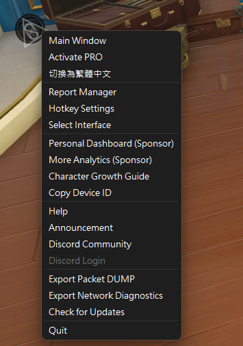

### Default Hotkeys

| Hotkey | Function |
|--------|----------|
| `F6` | Reset stats and save battle report |
| `Alt + D` | Show / Hide overlay |
| `Alt + E` | Show / Hide main window |

Hotkeys are customizable via right-click menu → Hotkey Settings.

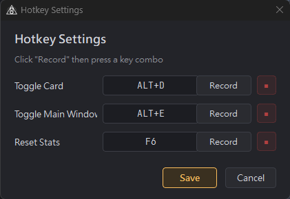

---

## FAQ

**Q: The overlay isn't responding?**
A: Make sure Npcap is installed (WinPcap-compatible mode) and the application is running as Administrator.

**Q: Can't capture packets with an accelerator/VPN active?**
A: Right-click the overlay → "Select Interface" to manually switch to the correct adapter.

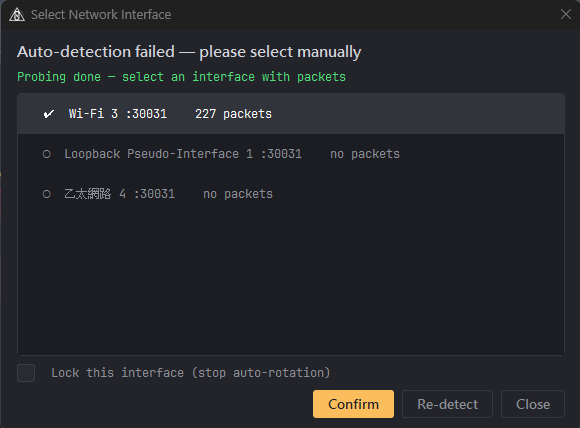

**Q: Are the displayed damage values accurate?**
A: Values come directly from combat packets sent by the game client, consistent with the game's internal calculations.

**Q: Why does my antivirus keep flagging it?**
A: Windows Defender may flag executables without an EV code signing certificate. Please add the program folder to your exclusion list:

Right-click Desktop → Display Settings → Privacy & Security → Windows Security → Virus & Threat Protection → Manage Settings → scroll to "Exclusions" → Add an exclusion → Folder → select the program directory

---

## Disclaimer

This software is provided solely for technical research and combat data analysis. It calculates combat data exclusively through passive network packet analysis — it does not modify game memory, alter network packets, or provide any form of automation.

This is a third-party tool with no affiliation to Hotta Studio or Perfect World. Despite its non-invasive design, the game publisher's definition of "third-party tools" may vary. Please review NTE's official policy before use. The developer assumes no legal liability or obligation to compensate for any account restrictions or losses resulting from the use of this software. By running the application, you agree to this disclaimer.

---

## Contact

- **Discord**: https://discord.gg/nbTMDCpvrB
- **Email**: dont.stop.ha@gmail.com

See [Support the Project](#support-the-project) for donation channels.
