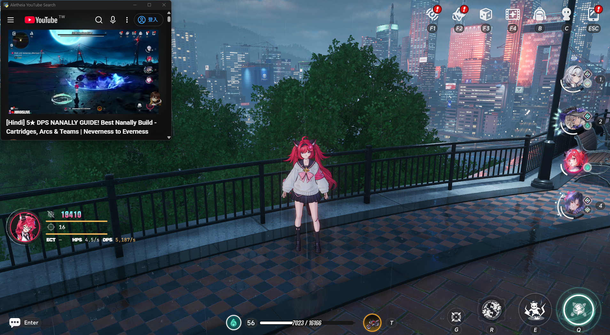

**[English](README.md)** | **[繁體中文](README_ZH.md)** | **简体中文**

# NTE DPS Meter

**Neverness to Everness (NTE)** 非侵入式实时伤害统计工具。

通过被动封包分析实时计算战斗数据 — **不修改内存、不篡改封包、不具备任何自动化功能**。

---

## 支持项目

如果这个工具对你有帮助，欢迎赞助支持持续开发：

### ☕ Ko-fi — 推荐

[](https://ko-fi.com/rj0217)

直接链接：[ko-fi.com/rj0217](https://ko-fi.com/rj0217)

赞助超过 6 美金，请让我们知道，我们希望能主动向您奉上赞助者序号（Pro 功能）以表谢意。

### 🪙 加密货币 — USDT / USDC (BEP20 / BSC network)

```
0x55c439b27807415e80452f59ba00fee3441a802d
```

赞助超过 6 美金，请让我们知道，我们希望能主动向您奉上赞助者序号（Pro 功能）以表谢意。

### 💬 联系方式

- **Discord**: https://discord.gg/nbTMDCpvrB
- **Email**: dont.stop.ha@gmail.com

---

## 功能

### 实时 DPS 浮窗

置顶透明卡片，三行式布局（伤害+量条 / 命中+量条 / ECT|HPS|DPS），游戏风格数字字体 + 金属色文字，全队简化列显示所有出场角色伤害与占比。战斗时自动展开，5 秒无命中自动收回。战斗中鼠标自动穿透，不影响游戏操作。


### 角色识别

自动识别当前操作角色，支持全部已上线角色。4 人队伍中每个角色独立追踪伤害。

### 战报与战报管理

按 **F6** 重置统计 — 当前战斗自动存为战报。从右键菜单打开战报管理，可依伤害范围筛选、排序、上传至社群平台或删除。


### 主窗口与伤害心电图（ECG）

一目了然的全队伤害贡献 — 角色排名栏 + 命中细节栏 + 伤害心电图三区布局。所有数据保存在本地。

**伤害心电图**将每一次命中绘制为即时波形。波色反映施放节奏（绿=密集连招、灰=正常、红=空窗）。X 轴以角色头像标记切换时机。支持拖拽惯性滚动、Ctrl+滚轮缩放。


### 战报对比（赞助者）

A/B 并排对比不同队伍配置，显示伤害与 DPS 差异摘要 + 整合 ECG。


### 个人数据中心（赞助者）

分析你的战斗历史，追踪个人成长轨迹。四个分页，所有数据纯本地处理。

| | |
|---|---|
|  |  |
| **战斗总览** — 总场次、累积伤害、最常使用角色、历史最大伤害、最近战斗 | **伤害成长** — 各角色伤害趋势曲线，点击头像切换 |
|  |  |
| **出场统计** — 角色使用频率 | **副本成长** — 各关卡伤害进步曲线 |

### 角色养成引导（免费）

20 角色养成素材一览 — 突破材料、技能升级（含被动）、好感度送礼三策略。


### 社群分析平台 — [ntedpsmeter.com](https://ntedpsmeter.com)

汇集社群上传的战斗数据：

- **角色伤害排行榜** — 依战斗时长分 Tier（1min / 3min / 6min / 9min），显示中位数 + 最大值 + 区间
- **角色配对矩阵** — 可视化角色搭配采用率热力图（赞助者限定）
- **Discord 登录** — 用 Discord 帐号登录网页端，赞助者可直接验证序号
- **三语网站** — EN / 繁體中文 / 简体中文
- **隐私友好** — 上传前须明确同意，数据匿名化

### 其他功能

- **YouTube 攻略搜索** — 右键菜单一键搜索当前角色攻略视频，独立浮窗播放



- **Discord 帐号连结** — 从桌面端一键连结 Discord，用于分析平台登录与序号验证
- **快捷键** — F6 重置、Alt+D 浮窗、Alt+E 主窗口；可完全自定义
- **网卡选择** — 手动切换网络接口，适用加速器/VPN 环境；持续支持 ExitLag
- **三语系界面** — 繁体中文 / 简体中文 / English（下拉菜单直选或右键菜单轮替）
- **系统托盘常驻** — 不占任务栏
- **自动更新** — 从右键菜单检查更新

---

## 免费 vs 赞助者

| 功能 | 免费 | 赞助者 |
|------|------|--------|
| DPS 浮窗 | ✔ | ✔ |
| 角色识别 | ✔ | ✔ |
| 伤害心电图（ECG） | ✔ | ✔ |
| 角色养成引导 | ✔ | ✔ |
| YouTube 攻略搜索 | ✔ | ✔ |
| 战报管理（存档/筛选/上传/删除） | ✔ | ✔ |
| 快捷键（浮窗/重置，可自定义） | ✔ | ✔ |
| 网卡选择 | ✔ | ✔ |
| 社群排行榜 | ✔ | ✔ |
| 主窗口（排名+细节+战报回顾） | ✔ | ✔ |
| 个人数据中心 | — | ✔ |
| 战报对比（A/B 并排 + ECG） | — | ✔ |
| 角色配对矩阵 | — | ✔ |

赞助者序号是支持开发的感谢回馈，不是订阅服务。每组序号有效期 **30 天**。免费功能永远不受限制。

---

## 安装与使用

### 系统需求
- Windows 10 / 11
- [Npcap](https://npcap.com/#download)（安装时勾选「Install Npcap in WinPcap API-compatible Mode」）

### 快速开始
1. 下载最新版本 → [Releases](../../releases)
2. 解压缩后 **右键 → 以管理员身份运行**
3. 启动 NTE — 首次命中后浮窗自动显示
4. 按 **F6** 重置并存档战报
5. 右键浮窗或系统托盘图标打开完整菜单


### 默认快捷键

| 快捷键 | 功能 |
|--------|------|
| `F6` | 重置统计并存档战报 |
| `Alt + D` | 显示/隐藏浮窗 |
| `Alt + E` | 显示/隐藏主窗口 |

快捷键可从右键菜单 → 快捷键设置自定义。


---

## 常见问题

**Q: 浮窗没有反应？**
A: 确认已以管理员身份运行，且 Npcap 已正确安装（WinPcap 兼容模式）。

**Q: 开了加速器后抓不到封包？**
A: 右键浮窗 →「选择网卡」，手动切换到正确的网络接口。


**Q: 显示的伤害数值准确吗？**
A: 数值直接来自游戏客户端发送的战斗封包，与游戏内部计算一致。

**Q: 为什么一直跳防毒检测？**
A: 本程序尚未购买 EV 代码签名证书，Windows Defender 可能将其标记为未知程序。请将程序所在文件夹加入排除列表：

桌面右键 → 显示设置 → 隐私和安全性 → Windows 安全中心 → 病毒和威胁防护 → 管理设置 → 向下滚动找到「排除项」→ 添加排除项 → 文件夹 → 选择程序所在目录

---

## 免责声明

本程序仅供技术交流与战斗数据分析使用。通过被动封包分析计算战斗数据，不修改游戏内存、不篡改游戏通讯封包，亦不具备任何自动化操作功能。

本工具为第三方辅助工具，与 Hotta Studio、Perfect World 无任何关联。尽管采非侵入式设计，但官方对「第三方辅助程序」定义不一。使用前请自行评估 NTE 官方政策。开发者不承担因使用本工具导致账号受限或任何损失的法律责任或补偿义务。运行程序即视为同意此声明。

---

## 联系信息

- **Discord**: https://discord.gg/nbTMDCpvrB
- **Email**: dont.stop.ha@gmail.com

请见上方[支持项目](#支持项目)段落了解赞助渠道。
