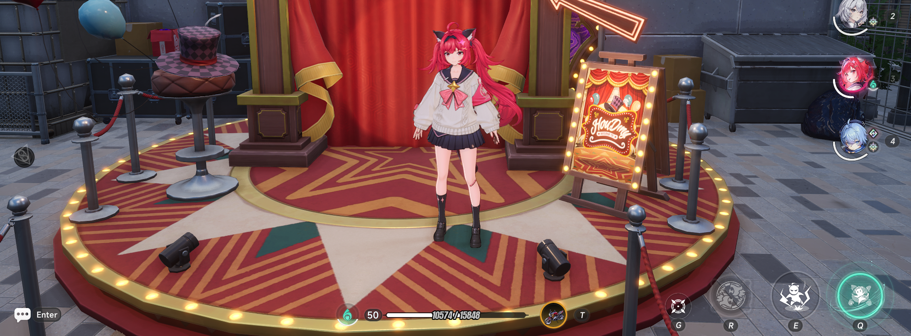
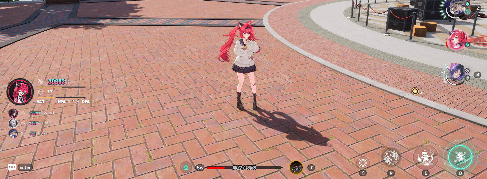
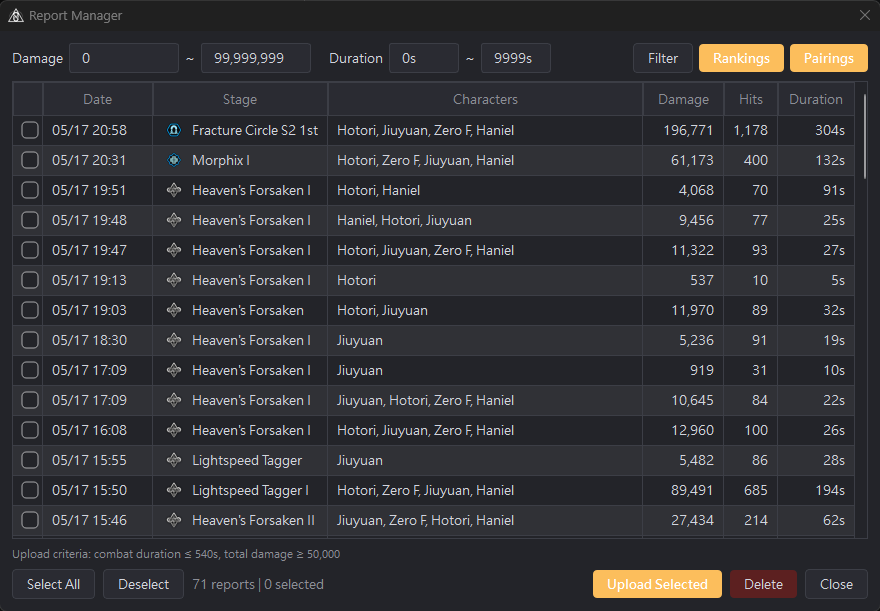
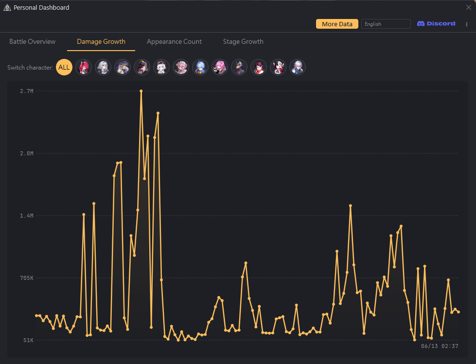
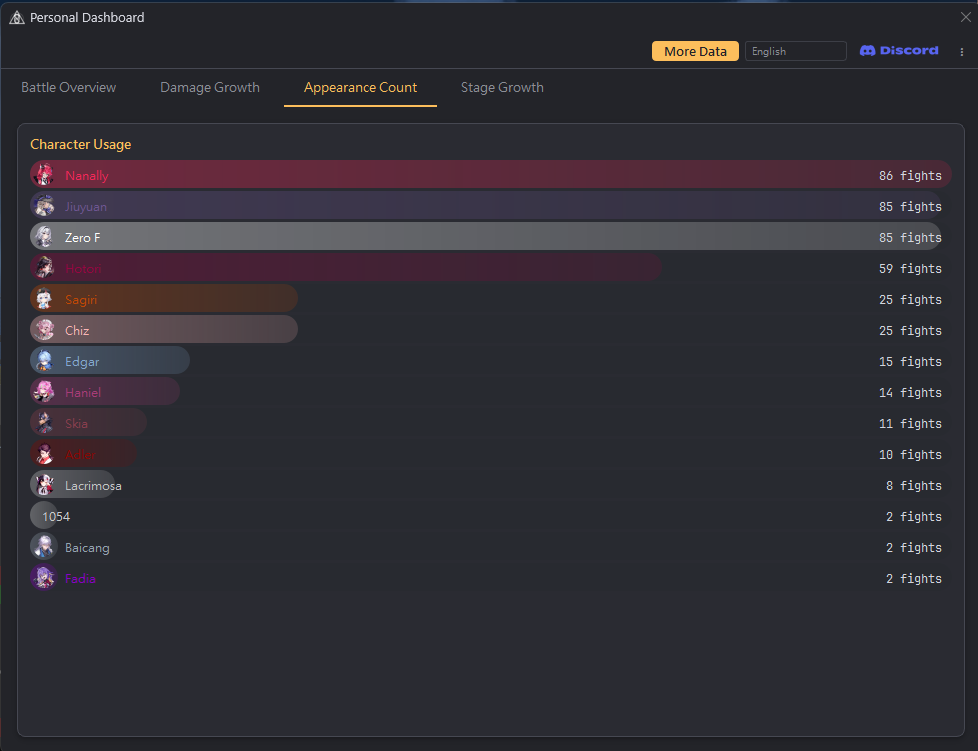
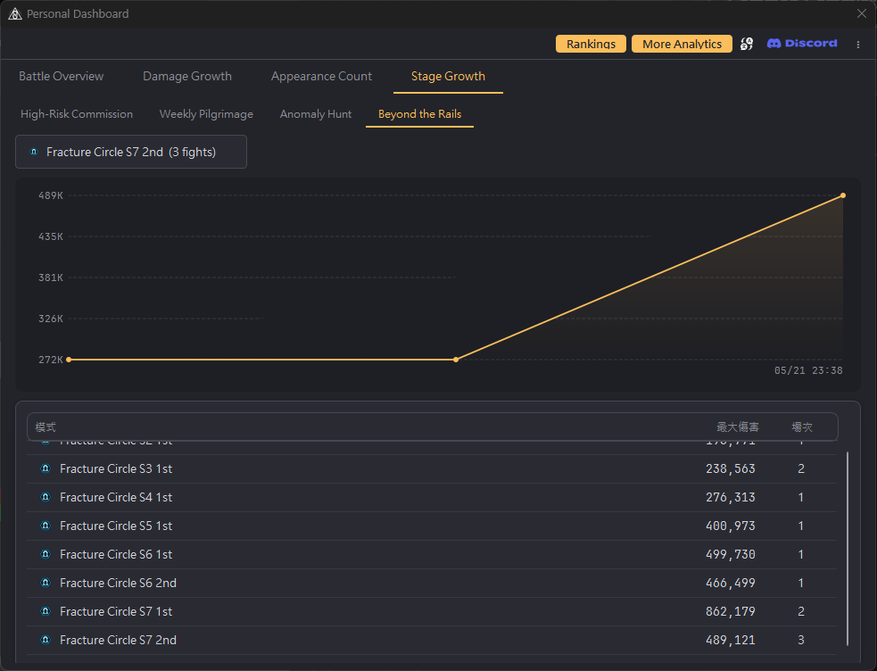
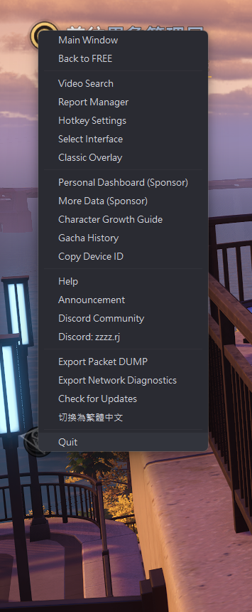
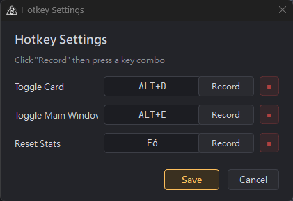
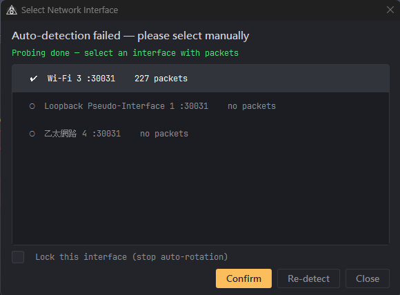

**[English](README.md)** | **[繁體中文](README_ZH.md)** | **[简体中文](README_CN.md)** | **日本語**

# NTE DPS Meter

**Neverness to Everness (NTE)** 向けの、非侵入型リアルタイム DPS メーターです。

パッシブなネットワークパケット監視によって戦闘データをリアルタイムで算出します — **メモリの改変なし、パケットの改竄なし、いかなる自動操作もなし**。

---

## プロジェクトを支援する

このツールがお役に立ちましたら、継続的な開発へのご支援をご検討ください：

### ☕ Ko-fi — おすすめ

[](https://ko-fi.com/rj0217)

直接リンク：[ko-fi.com/rj0217](https://ko-fi.com/rj0217)

6 USD 以上のご支援をいただいた場合は、ぜひご一報ください。感謝の印としてスポンサーシリアルキー（PRO 機能）をお贈りしたいと考えております。

### 🪙 暗号資産 — USDT / USDC（BEP20 / BSC network）

```
0x55c439b27807415e80452f59ba00fee3441a802d
```

6 USD 以上のご支援をいただいた場合は、ぜひご一報ください。感謝の印としてスポンサーシリアルキー（PRO 機能）をお贈りしたいと考えております。

### 💬 お問い合わせ

- **Discord**: https://discord.gg/nbTMDCpvrB
- **メール**: dont.stop.ha@gmail.com

---

## 機能

### リアルタイム DPS オーバーレイ

常に最前面に表示される透過カード。3 行レイアウト（ダメージ + バー / ヒット数 + バー / ECT | HPS | DPS）、ゲーム風スプライトフォント + メタリックなテキスト描画、そして出撃中の全キャラクターのダメージとチーム内割合を表示するパーティ行を備えています。戦闘中は自動で展開し、5 秒間操作がなければ自動で折りたたまれます。戦闘中はクリックが貫通するため、プレイの邪魔を一切しません。

**クラシックオーバーレイ** — ゲーム風の三層ボーダーを備えた、従来のレイドメーター風の常時表示パネル。ヘッダー行（名前 / ダメージ / 割合 / DPS）+ 各行に順位 + 円形アバター + キャラクター名（多言語対応）+ 総ダメージ（K/M）+ 割合 % + DPS を表示します。Normal / Mini の 2 サイズ。キャラクターカラーのダメージバーを低不透明度で描画。アニメーションなしで常に表示されます。右クリックメニューのサブメニューから切り替え可能。無料機能です。





### キャラクター検出

使用中のキャラクターをリアルタイムで自動識別します。実装済みの全キャラクターに対応し、4 人編成のパーティ内でキャラクターごとに独立してダメージを追跡します。また、ゲームモード（高危険度依頼 / 軌道外領域 / 異象巡礼 / 異象狩り / 九百九十九夜）も自動で判別し、専用アイコンとともに戦闘レポートへ記録します。

### 戦闘レポートとレポート管理

**F6** で統計をリセットすると、その時点の戦闘が自動的にレポートとして保存されます。右クリックメニューからレポート管理を開けば、ダメージ範囲やキャラクター／ターゲットによる絞り込み、並べ替え、コミュニティプラットフォームへのアップロード、古いレポートの削除ができます。レポートは保存後にバックグラウンドで自動アップロードされます（無料版は常時有効、スポンサーはオン／オフ切り替え可能）。



### メインウィンドウとダメージ心電図

チーム全体のダメージ貢献をひと目で把握できます — キャラクターランキングパネル + 戦闘詳細パネル（「発動 / ヒット」の 2 タブ：スキル別集計とヒット単位の内訳）+ ダメージ心電図の 3 分割レイアウト。すべてのデータはローカルに保存されます。

**ダメージ心電図**は、すべてのヒットをリアルタイムの波形として描画します。波の色は攻撃のリズムを表します（緑＝高速連撃、グレー＝通常、赤＝バースト間隔）。キャラクターの切り替え地点は X 軸上にアバターアイコンで示されます。慣性付きのドラッグスクロールと Ctrl + ホイールによるズームに対応しています。


### ガチャ履歴

ゲーム内のガチャ履歴パケットをパッシブに取得します — キャラクターバナー（モノポリー式ダイス）と武器バナー（直接抽選）を自動判別。2 階層のタブウィンドウで、統計カード、アイテム一覧、S ランクの天井距離マップを確認できます。ローカルへの記録はアップロード同意の有無にかかわらず常に有効です。無料機能です。


### レポート比較（スポンサー）

異なるチーム編成を A/B で並べて比較し、ダメージと DPS の差分サマリー + 統合された心電図を表示します。


### マイデータセンター（スポンサー）

4 つのタブで戦闘履歴を分析し、個人の成長を追跡できます。すべてのデータはローカルで処理され、アップロードは一切行われません。

| | |
|---|---|
|  |  |
| **戦闘概要** — キャラクターの全身イラスト + 覚醒背景のヒーローエリア、最大ダメージ / DPS / 戦闘回数のデータカード、ダメージ履歴テーブル、直近の戦闘。キャラクターのアバタータブをクリックして切り替えます。 | **ダメージ成長曲線** — キャラクター別のダメージ推移カーブ、アバターのクリックで表示を切り替え |
|  |  |
| **出場回数統計** — キャラクターの使用頻度 | **コンテンツ成長曲線** — コンテンツ別のダメージ推移カーブ |

### キャラクター育成ガイド（無料）

22 キャラクター分の素材一覧 — 突破素材、スキル強化（パッシブ含む）、そして 3 つの最適化モードを備えた好感度ギフト攻略。


### コミュニティ分析 — [ntedpsmeter.com](https://ntedpsmeter.com)

アップロードされた戦闘レポートを集計した、コミュニティのライブデータ：

- **キャラクターランキング** — ティア別（1分 / 3分 / 6分）の総合ランキング + アバタータグ切り替えによるキャラクター別トップ 50 ランキング。1 位は金色のグロー + 名前のシマー演出
- **運勢ランキング** — 3 つのカテゴリ（限定キャラクター / 恒常キャラクター / 武器バナー）における S ランク平均天井距離のランキング。S ランク 2 回以上の記録が必要（スポンサー）
- **キャラクター編成マトリクス** — キャラクターの組み合わせ採用率を可視化したヒートマップ（スポンサー）
- **かんたんツール — パーティ編成** — 無料・ログイン不要：キャラクターカードをタップして 4 枠を埋めると、8 種類の異能連環がどれだけ揃うかをその場で確認できます
- **Discord ログイン** — Discord でログイン可能。スポンサーはウェブ上で直接シリアルキーを認証できます
- **スポンサー購入** — 海外のユーザーは [ntedpsmeter.com/purchase](https://ntedpsmeter.com/purchase) にて PayPal / Ko-fi で自己申込が可能。決済後にシリアルキーが自動でメール送信されます（30 / 60 / 90 日 ＝ 6 / 11 / 15 USD）。台湾のユーザーは Discord までご連絡ください
- **5 言語対応** — EN / 繁體中文 / 简体中文 / 日本語 / 한국어
- **プライバシーに配慮** — アップロード前に明確な同意が必要、データは匿名化されます

### その他の機能

- **動画検索** — 複数のプラットフォーム（YouTube / Bilibili / ニコニコ動画）からキャラクター攻略動画を検索し、フローティングウィンドウで再生


- **ガチャ履歴** — キャラクターバナーと武器バナーの抽選をパッシブに記録、天井マップとファッション追跡付き
- **クラシックオーバーレイ** — ゲーム風ボーダーとヘッダー行を備えた従来型レイドメーターパネル、Normal / Mini サイズ、右クリックメニューのサブメニューから切り替え
- **全ユーザー Discord ログイン** — 無料版・スポンサーともに起動時に一度だけ Discord ログインを行います（連携済みのユーザーは影響を受けません）。シリアルを所有者に紐づけ、不正利用を防ぎます
- **戦闘レポートの自動アップロード** — レポートは保存後にバックグラウンドで自動アップロードされます。無料版は常時有効、スポンサーは切り替え可能
- **通知ドット** — 新しいレポートが保存されたときや新バージョンがあるとき、赤いドットが該当機能まで案内します
- **初回起動時の言語自動判定** — Windows のシステムロケールに基づいてインターフェース言語が自動選択されます。手動で変更した場合はその設定が保持されます
- **ホットキー** — F6 リセット、Alt+D オーバーレイ、Alt+E メインウィンドウ；すべてカスタマイズ可能
- **ネットワークアダプターの選択** — ゲームアクセラレーター／VPN 環境向けの手動切り替え。ExitLag は継続的にサポート
- **4 言語インターフェース** — 繁體中文 / 简体中文 / English / 日本語（ドロップダウン選択、または右クリックメニューで循環切り替え）
- **システムトレイ常駐** — タスクバーを占有せず、静かに動作します
- **自動アップデーター** — 右クリックメニューから更新を確認できます

---

## 無料版とスポンサー版

| 機能 | 無料 | スポンサー |
|---------|------|---------|
| DPS オーバーレイ | ✔ | ✔ |
| クラシックオーバーレイ | ✔ | ✔ |
| キャラクター検出 | ✔ | ✔ |
| ダメージ心電図 | ✔ | ✔ |
| キャラクター育成ガイド | ✔ | ✔ |
| ガチャ履歴 | ✔ | ✔ |
| 動画検索 | ✔ | ✔ |
| レポート管理（保存 / 絞り込み / アップロード / 削除） | ✔ | ✔ |
| 戦闘レポートの自動アップロード | ✔ | ✔（切り替え可能） |
| ホットキー（オーバーレイ / リセット、カスタマイズ可能） | ✔ | ✔ |
| ネットワークアダプターの選択 | ✔ | ✔ |
| コミュニティランキング | ✔ | ✔ |
| メインウィンドウ（ランキング + ヒット詳細 + レポート閲覧） | ✔ | ✔ |
| マイデータセンター | — | ✔ |
| レポート比較（A/B 並列 + 心電図） | — | ✔ |
| キャラクター編成マトリクス | — | ✔ |
| コミュニティガチャ統計 | — | ✔ |

スポンサーキーは開発を支援してくださったことへの感謝の印であり、サブスクリプションではありません。シリアルキーの有効期間はティアに応じて **30 / 60 / 90 日**です。無料機能が制限されることは決してありません。

---

## インストールと使い方

### 動作要件
- Windows 10 / 11
- [Npcap](https://npcap.com/#download)（インストール時に "Install Npcap in WinPcap API-compatible Mode" にチェックを入れてください）

### クイックスタート
1. 最新版をダウンロード → [Releases](../../releases)
2. 展開後、**右クリック → 管理者として実行**
3. NTE を起動 — 最初のヒットでオーバーレイが自動表示されます
4. **F6** で統計をリセットし、戦闘レポートを保存
5. オーバーレイまたはシステムトレイアイコンを右クリックすると全メニューが開きます



### 既定のホットキー

| ホットキー | 機能 |
|--------|----------|
| `F6` | 統計をリセットし、戦闘レポートを保存 |
| `Alt + D` | オーバーレイの表示 / 非表示 |
| `Alt + E` | メインウィンドウの表示 / 非表示 |

ホットキーは右クリックメニュー → ホットキー設定からカスタマイズできます。



---

## よくある質問

**Q: オーバーレイが反応しません**
A: Npcap がインストールされているか（WinPcap 互換モード）、そしてアプリケーションを管理者として実行しているかをご確認ください。

**Q: ゲームアクセラレーター／VPN を使用中にパケットを取得できません**
A: オーバーレイを右クリック →「ネットワークアダプターを選択」から、正しいアダプターに手動で切り替えてください。



**Q: 表示されるダメージ数値は正確ですか？**
A: 数値はゲームクライアントが送信する戦闘パケットから直接取得しており、ゲーム内部の計算と一致します。

**Q: ウイルス対策ソフトに検出されてしまいます**
A: Windows Defender は EV コード署名証明書のない実行ファイルを検出することがあります。プログラムのフォルダーを除外リストに追加してください：

デスクトップを右クリック → ディスプレイ設定 → プライバシーとセキュリティ → Windows セキュリティ → ウイルスと脅威の防止 → 設定の管理 → 「除外」までスクロール → 除外の追加 → フォルダー → プログラムのディレクトリを選択

---

## 免責事項

本ソフトウェアは、技術研究および戦闘データ分析のみを目的として提供されています。パッシブなネットワークパケット解析のみによって戦闘データを算出しており、ゲームのメモリを改変したり、ネットワークパケットを改竄したり、いかなる形の自動操作も提供したりはしません。

本ソフトウェアは Hotta Studio および Perfect World とは一切関係のないサードパーティ製ツールです。非侵入型の設計ではありますが、ゲーム運営会社による「サードパーティ製ツール」の定義は異なる可能性があります。ご使用前に NTE の公式方針をご確認ください。本ソフトウェアの使用に起因するアカウントの制限や損失について、開発者は法的責任および賠償の義務を一切負いません。本アプリケーションを実行した時点で、本免責事項に同意したものとみなされます。

---

## お問い合わせ

- **Discord**: https://discord.gg/nbTMDCpvrB
- **メール**: dont.stop.ha@gmail.com

ご支援の方法については[プロジェクトを支援する](#プロジェクトを支援する)をご覧ください。
